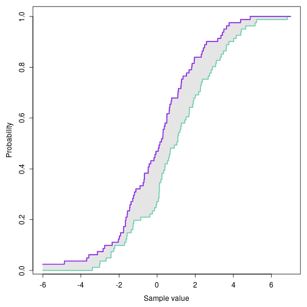
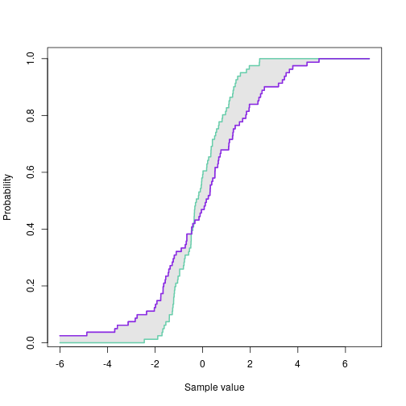

## Model evaluation with the integrated quadratic distance (IQD)
### Authors: Thordis L. Thorarinsdottir (thordis@nr.no) and Marion Haugen

The integrated quadratic distance (IQD) measures the similarity between two distributions by the integral over the squared difference between the two distribution functions. For background information on the IQD and its properties, see

T L Thorarinsdottir, J Sillmann, M Haugen, N Gissibl and M Sandstad (2020): Evaluation of CMIP5 and CMIP6 simulations of historical surface air temperature extremes using proper evaluation methods. Environmental Research Letters, 15: 124041.

T L Thorarinsdottir, T Gneiting and N Gissibl (2013): Using proper divergence functions to evaluate climate models. SIAM/ASA Journal on Uncertainty Quantification, 1(1): 522-534.

For examples of the use of the IQD, see the example below or 

Q Yuan, T L Thorarinsdottir, S Beldring, W K Wong, S Huang and C-Y Xu (2019):  New approach for bias correction and stochastic downscaling of future projections for daily mean temperatures to a high-resolution grid. Journal of Applied Meteorology and Climatology, 58: 2617-2632.

Three functions for calculating the IQD between two empirical distribution functions (ECDFs) are available: 

* **IQD_crps(X,Y)** uses the sample version of the continuous ranked probability score (CRPS), as implemented in the R package scoringRules, where **X** and **Y** are vectors of values corresponding to the two ECDFs. 

* **IQD_integrate(X,Y)** uses direct numerical integration of the IQD formula, where **X** and **Y** are vectors corresponding to the two ECDFs.

* **wIQD_integrate(X,Y,wFct)** uses direct numerical integration of the IQD formula to calculate a weighted version of the IQD for the weight function **wFct**, where **X** and **Y** are vectors corresponding to the two ECDFs (see Yuan et al. (2019) for examples of weight functions).

The following are needed to use these functions: 


```r
library(scoringRules)
source("IQDfunctions.R")
```


### Example of the use of the IQD 

Example 1:


```r
set.seed(17)
z <- seq(from=-6, to=7, by=0.001)
x1  <- rnorm(81, mean=0, sd=2)
x2  <- rnorm(81, mean=1, sd=2)
y1 <- ecdf(x1)
y2 <- ecdf(x2)
par(mex=0.75, mar=c(5,5,1,1))
cols <- c("blueviolet", "aquamarine3")
plot(	z,
	y1(z),
	type="l",
	col=cols[1],
	lwd=2,
	ylab="Probability",
	xlab="Sample value")
polygon( c(z, rev(z), z[1]),
	 c(y2(z), rev(y1(z)), y1(z)[1]),
	 col="gray90",
	 border=NA )
lines(	z, y2(z), col=cols[2], lwd=2 )
lines(	z, y1(z), col=cols[1], lwd=2 )
```



Calculate the IQD 


```r
PrintIQD(x1,x2) 
```

```
## [1] "IQD_crps      = 0.13072064"
## [1] "IQD_integrate = 0.13069875"
```

Example 2: 


```r
x3  <- rnorm(81, mean=0, sd=1)
y2 <- ecdf(x3)
plot( z,
      y1(z),
      type="l",
      col=cols[1],
      lwd=2,
      ylab="Probability",
      xlab="Sample value" )
polygon(  c(z[1:6001], rev(z[1:6001]), z[1]),
	  c(y2(z)[1:6001], rev(y1(z)[1:6001]),
	  y1(z)[1]), col="gray90", border="NA" )
polygon(  c(z[6001:13001], rev(z[6001:13001]), z[6001]),
	  c(y1(z)[6001:13001], rev(y2(z)[6001:13001]), y2(z)[6001]),
	  col="gray90",
	  border="NA" )
lines(  z, y2(z), col=cols[2], lwd=2 )
lines(  z, y1(z), col=cols[1], lwd=2 )
```




```r
PrintIQD(x1,x3) 
```


### Acknowledgements

Parts of this work were funded by the Research Council of Norway through grants nr. 243953 "Physical and statistical analysis of climate extremes in large datasets" and 255517 "Post-processing Climate Projection Output for Key Users in Norway", and the European Union, Horizon 2020 through grant nr. 820655 "EXHAUSTION". 
```
## [1] "IQD_crps      = 0.09622251"
## [1] "IQD_integrate = 0.09621762"
```
